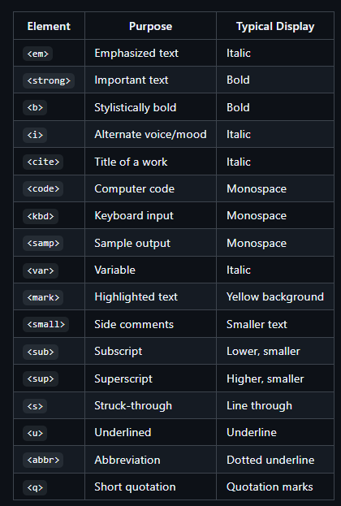
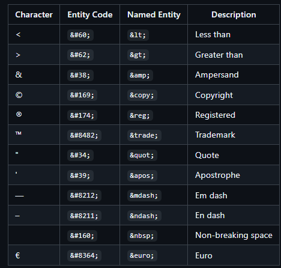

---

marp: true
theme: uncover
paginate: true
class: invert

---

# 🧠 HTML Flipped Classroom Project  
### Lesson X: HTML lesson 3 
**Team Members:** Max H, Max R, Gio G.A
**Class:** Software Engineering & Web Development  

---

## 🎯 Learning Objectives
Html lesson 3
- Use text-level elements for semantic meaning, structure, and add visual appeal
- Insert and be able to use images
- Create hyperlinks to pages, email addresses, and phone numbers
- Be able to make a navagation system using links

--- 

## 🧩 Introduction 
Students will learn Text-Level Elements, Images, and Hyperlinks.


**Class Question:**  
💭 *Why do you think this topic is important for building websites?*

---

## 🧱 Key Concept #1 — Common Text-Level Elements
Text-Level elements mark up content within block level elements like paragraphs and headings.

---


These are the different type of Text-Level Elements 


---
**Explain:**
- Markdown is a lightweight markup language that adds.
- semantic meaning
- structure
- visual appeal to text.

This is *Emphasized text*(usually italic)
```<p>This is <em></em>Emphasized text</em>(usually italic)</p>```


---
## 💬 Quick Check

Why is Text-Level Elements used?

A. For better sturcuring and to emphasize the importance of a pages content. 
B. For boring Text with no appeal, structure, or sematnic meaning.
C. For images.
D. For building navigation systems with links.


---


### 🧱 Key Concept #2 — [Special Characters and Character Entities]

* Some characters have special meanings in HTML
* Syntax: All HTML character entity references must start with an ampersand (&) and end with a semicolon (;)


   HTML requires special codes, called **character entities**, to display certain
    symbols that have meaning in HTML (like the angle brackets) or are not easily
    typed.
---

 



---

 
 ```html
  <p>
    For example, to display a **less than sign** ($<$) you use
    `&lt;` or `&#60;`.
    A **greater than sign** ($>$) is written as
    `&gt;` or `&#62;`.
  </p>
  <p>
    To show the **ampersand** ($\&$), which starts an entity, you must use
    `&amp;` or `&#38;`.
  </p>
  <p>
    Other common entities include:
    <ul>
      <li>**Non-breaking space:** `&nbsp;` (or `&#160;`) - useful for preventing line breaks.</li>
      <li>**Copyright symbol:** `&copy;` (or `&#169;`) - &copy; 2025</li>
      <li>**Euro symbol:** `&euro;` (or `&#8364;`) - Price: &euro;50</li>
    </ul>
```


---

For example, to display a **less than sign** ($<$) you use
`&lt;` or `&#60;`.
A **greater than sign** ($>$) is written as
`&gt;` or `&#62;`.

To show the **ampersand** ($\&$), which starts an entity, you must use
`&amp;` or `&#38;`.

Other common entities include:
* **Non-breaking space:** `&nbsp;` (or `&#160;`) - useful for preventing line breaks.
* **Copyright symbol:** `&copy;` (or `&#169;`) - &copy; 2025
* **Euro symbol:** `&euro;` (or `&#8364;`) - Price: &euro;50
  
    


---

🧩 **Class Activity Idea:**
Turn to a neighboor and have a brief 30 second discussion on what we learned so far

---

## 💡 Real-World Example
```html
<footer>
    <p>
        &copy; 2024 Your Company, Inc. | All Rights Reserved
    </p>
    <p>
        Product Name&trade;
    </p>
</footer>
```
---
# How Code is Displayed


© 2024 Your Company, Inc. | All Rights Reserved

Product Name™

---

## 🧠 Concept #3 — [Hypertext Links]

Hypertext uses links to connect text non-sequentially. It allows readers to jump between related information. The World Wide Web is its largest application.

---
```html
<p>
    This is the main text. Click the **hyperlink** below for more.
</p>

<p>
    Access <a href="https://www.google.com">Google's homepage</a>.
</p>

<p>
    Go to the <a href="#info">Internal Info</a> section.
</p>

<h2 id="info">Internal Info</h2>
<p>You jumped here!</p>
```

---


This is the main text. Click the hyperlink below for more.

Access Google's homepage.

Go to the Internal Info section.

Internal Info
You jumped here!

---


## 💭 Class Interaction

**Question for Discussion:**

* How does this HTML element improve usability or accessibility?
* What might happen if this tag or attribute is missing?

Encourage short responses or hands-up participation.

---


## 📝 Summary

Semantics: Use inline elements (<em>, <strong>) for meaning and structure inside block elements (<p>). Helps SEO and Accessibility.

Characters: Use character entities (&lt;, &amp;, &copy;) to correctly display special/reserved characters.

Links: The <a> tag creates connections for navigation:

External sites

Page sections (#id)

Emails/Phones

---

💬 **Exit Question:**
What’s one thing about this topic that surprised you?


---
## 🙌 Thank You!

**Team:** Max H, Max R, Gio G.A
**Lesson:** Lesson X: HTML lesson 3
**Presented by:** [Class / Section]
> “Code it, teach it, and own it.”
